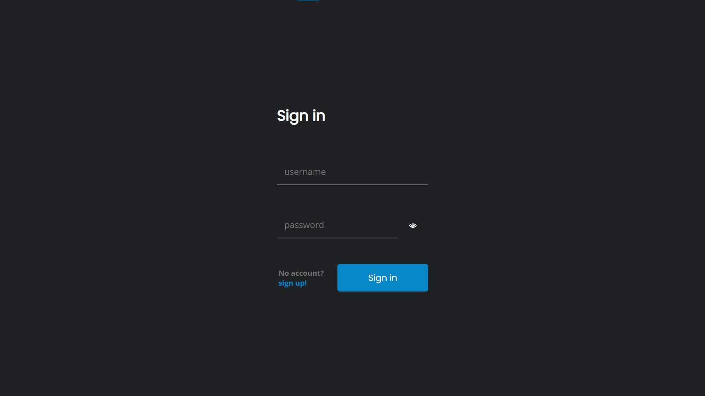
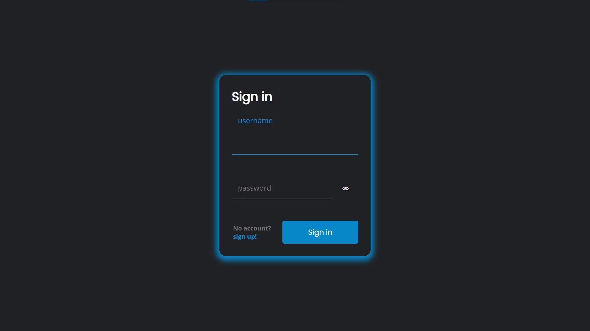
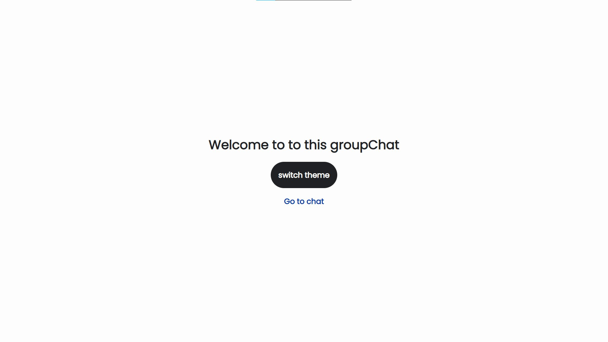
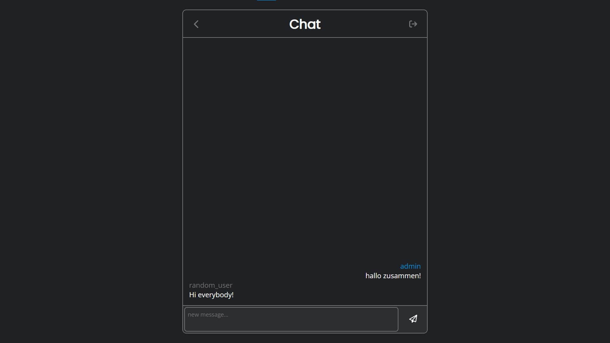
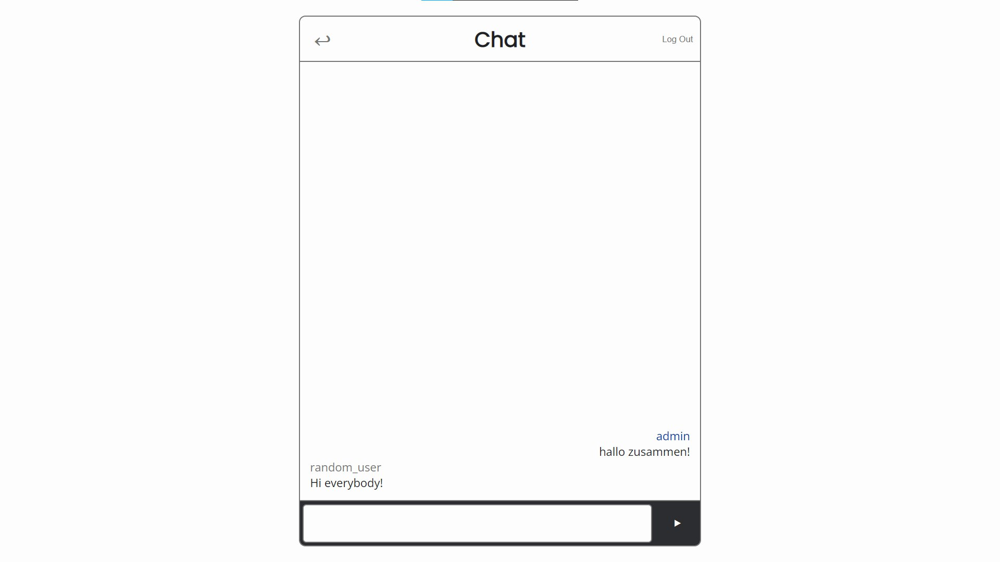

Single example common group chat (chat room) for many
users. Example usage as common chat for some organisation
like school or university which can be independent from
other messengers and hosted on own or shared server.
 
 
<h1>Here comes the preview</h1>
 

 

 

 

 

 

 
<h2>how to set up for own usage?</h2>
 
1. clone this repo
2. install all dependencies in server and client folders with 'npm install' or 'yarn'
3. in server connect to your database and add .env file with ypur private key
4. change links in client part to your api
5. run the app locally or build it and host it
6. enjoy using the chat
